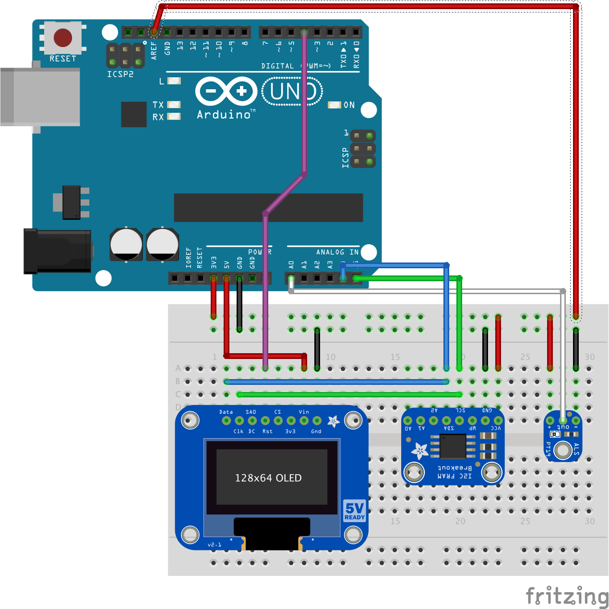

# DAQ: Data Acquisition System
This project uses a Raspberry Pi and Arduino Uno to create a high speed data acquisition system. The project is based on the OpenLabTools guide provided by the Univeristy of Cambridge, provided [here](http://openlabtools.eng.cam.ac.uk/Resources/Datalog/RPi_Arduino/). There are a few modifications from the original guide and implementation differences.   

An immensely helpful reference is the Atmel ATmega328/P datasheet, found [here](http://ww1.microchip.com/downloads/en/DeviceDoc/Atmel-42735-8-bit-AVR-Microcontroller-ATmega328-328P_Datasheet.pdf).

# Hardware
   * Arduino Uno
   * Light Sensor
   * USB Serial Cable
   * ~~OLED Display~~  
   * ~~Raspberry Pi 2~~
   * ~~Adafruit T-Cobbler Plus~~

   

# Specifications
The goal for this project is to:
- Sample at 100 KHz.
  - For a presclaer of 8, the top register should be 19.
- Use Timer1 Compare Match B (TOP register is ICR1) to trigger a timer interrupt.
- Use analog input A0.
- Set the reference voltage to 3.3 V.
- Use an ADC prescale of 8 to achieve fast ADC conversion speeds (2 MHz).
- Have the ADC result left shifted to achieve an 8-bit result stored in ADCH.

# Code Guide
The code guide section is an explanation of some of the firmware choices for this project, and hopefully a reference for others looking to create their own DAQ, or expand and improve upon this design.
### ADMXUX

|   7  |   6  |   5  |   4  |   3  |   2  |   1  |   0  |
|:----:|:----:|:----:|:----:|:----:|:----:|:----:|:----:|
|REFS1|REFS0|ADLAR|--|MUX3|MUX2|MUX1|MUX0|
|0|0|1|--|0|0|0|0|

**[7:6]** Sets the reference voltage. This configuration sets the reference voltage to the AREF pin. For now the 5V output pin is connected to AREF.

**[ 5 ]** Left shifts the 10 bit conversion result so the ADCH register contains an 8-bit result from the ADC. Example:
* ADLAR = 0, ADCH = ---- --11, ADCL = 1011 0101
* ADLAR = 1, ADCH = 1110 1101, ADCL = 01-- ---

**[3:0]** Selects the analog pin being used for ADC, this configuration sets the pin to A0.

### ADSCRA
|   7  |   6  |   5  |   4  |   3  |   2  |   1  |   0  |
|:----:|:----:|:----:|:----:|:----:|:----:|:----:|:----:|
|ADEN|ADSC|ADATE|ADIF|ADIE|ADPS2|ADPS1|ADPS0|
|1|X|1|X|X|0|1|1

**[ 7 ]** Enables ADC.

**[ 6 ]** Starts an ADC conversion, not set in the config function, set in the enableInterrupts() function.

**[ 5 ]** Enables auto-triggering of the ADC (in our case Timer1 interrupt is used as the trigger).

**[ 4 ]** This bit set when an ADC conversion is finished, no need to do anything for this bit.

**[ 3 ]** Enables ADC interrupt, set in enableInterrupts() function.

**[2:0]** Sets prescaler of ADC clock, this configuration sets the presclaer to 8.

### ADCSRB
|   7  |   6  |   5  |   4  |   3  |   2  |   1  |   0  |
|:----:|:----:|:----:|:----:|:----:|:----:|:----:|:----:|
|--|ACME|--|--|--|ADTS2|ADTS1|ADTS0|
|--|0|--|--|--|1|0|1|

**[ 7 ]** Reserved.

**[ 6 ]** Analog Comparator Multiplexor. This bit is not used and set to zero.

**[5:3]** Reserved.

**[2:0]** Sets the ADC auto trigger source. In this case we have chosen Timer1, Compare Match B.

### TCCR1A
|   7  |   6  |   5  |   4  |   3  |   2  |   1  |   0  |
|:----:|:----:|:----:|:----:|:----:|:----:|:----:|:----:|
|COM1|COM1|COM1|COM1|--|--|WGM11|WGM10|
|0|0|0|0|--|--|0|0

**[7:4]** Not using these bits, set to zero.

**[3:2]** Reserved.

**[1:0]** These bits are the first part of selecting the compare match mode and top register. This configuration is for selecting compare match B, top register is ICR1.

### TCCR1B
|   7  |   6  |   5  |   4  |   3  |   2  |   1  |   0  |
|:----:|:----:|:----:|:----:|:----:|:----:|:----:|:----:|
|ICNC1|ICES1|--|WGM13|WGM12|CS12|CS11|CS10|
|0|0|--|0|1|1|0|1|

**[7:6]** Not used, set to zero.

**[4:3]** These bits are the second part of selecting the compare match mode and top register. This configuration is for selecting compare match B, top register is ICR1.

**[2:0]** Sets prescaler for timer, this configuration set's the prescaler to 8.

### ICR1

ICR1 = 19
